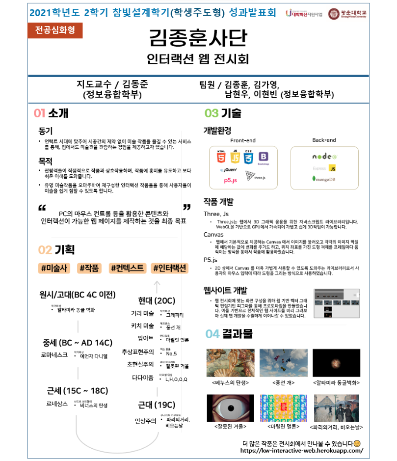

# 예술 작품 인터랙션 웹 전시회

## Interactive Web Exhibition

### 21학년 2학기 광운대 참빛설계학기 팀프로젝트

---

> 언택트 시대에 맞추어 시공간의 제약 없이 미술 작품을 즐길 수 있는 서비스를 통해, 집에서도 미술관을 관람하는 경험을 제공
>
> > 관람객들이 직접적으로 작품과 상호작용하며, 작품에 흥미를 유도하고 보다 쉬운 이해를 도움
> > 유명 미술 작품을 오마주하여 재구성한 인터랙션 작품들을 통해 사용자들이 미술을 쉽게 접할 수 있도록 함

### 1. 개발 스택

- HTML
- CSS
- Javascript

* jQuery
* bootstrap

- p5.js : HTML의 Canvas 손쉽게 사용할 수 있는 라이브러리
- three.js : 웹 3D 그래픽 응용을 위한 WebGL 기반 라이브러리

* MongoDB : 사용자 방명록 데이터 저장
* Express : Backend 서버
* NodeJS : Javascript 런타임 환경

### 2. 디자인 프로토타입

- Figma : 웹 전시회 화면 구성을 위한 웹 기반 벡터 그래픽 편집기

### 3. 웹 배포

- Heroku

### 4. 웹 구성 과정

1. 미술사에 대한 흐름을 전달하기 위해 각 시대별 대표적인 예술 사조와 예술 작품을 선정
2. 작품의 맥락 (Context) 를 효과적으로 전달할 수 있는 상호작용 효과 결정
3. 예술 작품에 동적인 상호작용을 가하기 위해서 Javascript 와 HTML 태그를 유기적으로 구성
4. 관람객들의 감상을 기록할 수 있게 Backend 기술을 사용하여 방명록 데이터 저장

---

### 전시 작품

- 원시 / 고대 (BC 4C 이전)
  + 알타미라 동굴 벽화 - 작가 미상

- 중세 (BC 4C ~ AD 14C)
  + 예언자 다니엘 - 작가 미상

- 근세 (15C ~ 18C)
  + [르네상스] 비너스의 탄생 - 산드로 보티첼리

- 근대 (19C)
  + [인상주의] 파리의 거리, 비오는 날 - 구스타브 카유보트

- 현대 (20C ~)
  + [입체주의] 자화상 - 피카소 
  + [다다이즘] L.H.O.O.Q. - 마르셀 뒤샹 
  + [초현실주의] 잘못된 거울 - 르네 마그리트 
  + [추상표현주의] No.5 - 잭슨 폴록 
  + [팝아트] 마릴린 먼로 - 앤디 워홀  
  + [키치 미술] 풍선개 - 제프 쿤스 
  + [거리 미술] 그래피티 - 작가 미상

---

### 프로젝트 구성

- deploy : 배포 파일
  - static : 화면 구성에 필요한 참조 파일
    - html files : 전시회 페이지 및 각각의 미술 작품 페이지
    - detail : 작품 설명용 작품 사진
    - js : 참조 Javascript 파일
    - css : 참조 CSS 파일
    - media : 아이콘 SVG 파일
    - mp3 : 작품 배경 음악 및 효과음
    - pieces : 작품 구현에 필요한 원작 미술 작품 사진

---

### <참빛설계학기 성과발표회 판넬 자료사진>

---

웹 주소 >>
[Interaction-Web-Exhibition](http://kw-interactive-web.herokuapp.com) >> closed
